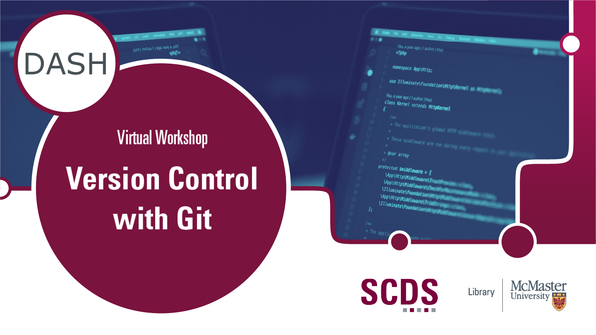

<!-- 
This will be the home page of your module. It should give a small introduction to the student about the workshop topic.
Add, edit, or remove any content below for the workshop in question. -->

<!-- Title slide image. Replace img src with your own, or comment this out. -->

<!-- Main header -->
# Introduction to Version Control with Git

Come learn about Git! Git is a version control system widely used in software engineering, academia, and anywhere where projects need reliable and granular versioning – especially when the projects need to scale to thousands of contributors. 

In this tutorial, you’ll learn the basics of working with Git repositories, how to sync your local repository to GitHub, and more!

Presentation by John Fink, Digital Scholarship Librarian. [Book an appointment with John or another member of the SCDS Team.](https://libcal.mcmaster.ca/appointments/)

The module content is derived and adapted from [The Carpentries](https://carpentries.org/).

## Prerequisites
<!-- If creating or installing is covered in the module (preparation), mention that in brackets. -->
- A [GitHub.com](https://www.github.com) account
- An installation of [Git](https://git-scm.com/) (this will be covered in the Preparation page)

<!-- What will the student learn to do, learn to use, etc. -->
## Learning Objectives
By the end of this workshop, you will be able to:
- Describe the benefits of versioning and version control software
- Understand the differences between Git and GitHub
- Create a Git repository and commit changes
- Push and pull changes between your local repository and your remote repository

<!-- Estimate the time the workshop will take to complete. Feel free to remove this. -->
## Duration
This module will take around an hour, however feel free to work at your own pace!

## Land Acknowledgement
We'd like to acknowledge that McMaster University sits on the Territories of the Mississauga and Haudenosaunee Nations, and within the lands protected by the Dish With One Spoon wampum agreement.
