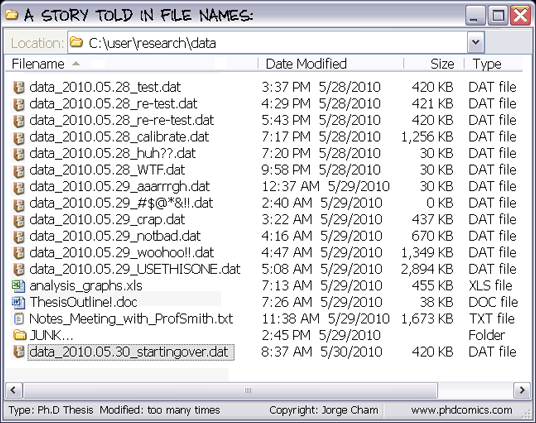

<!-- 
This page will go over introductory content to the workshop. 
If your workshop has an introduction sequence, whether it be history, "Why should you use __", or anything of that matter, this is where it goes! If your workshop doesn't need this, delete introduction.md from the repository. 
Add, edit, or remove any content below for the workshop in question. 
-->

# Workshop Introduction 
<!-- Follow along with the introductory video, slides, or text below. -->

<!-- If your page has a video to go along with it, put it here. -->
<!-- <iframe height="416" width="100%" allowfullscreen frameborder=0 src="https://echo360.ca/media/a65689c0-c35c-4f33-9c12-f0ac97883f54/public?autoplay=false&automute=false"></iframe>
[View original here.](https://echo360.ca/media/a65689c0-c35c-4f33-9c12-f0ac97883f54/public?autoplay=false&automute=false)

<embed width="100%" height="466" src="assets/docs/examplePDF.pdf" style="border:none;">
[Download slides here.](assets/docs/examplePDF.pdf) -->

<!-- Below the video/slides, this is where you put the text version of the page. -->
## What is Version Control?

Before we begin talking about Git, let's talk about version control. Keeping track of changes and versions of *things*, whether it be books, files, software, projects, or just about anything, is known as version control. Although not recommended, version control can be done manually.

<ins> *Image credit: [PhDComics](https://phdcomics.com/comics.php?f=1323) \| Image © jorge cham* </ins>

Manual version control does create some problems.

- Your work folder will get cluttered really quickly.
- You may accidentally edit or overwrite the wrong file.
- You may also develop a bad naming system for files.
- It’s easier to forget or ignore.
- It’s harder to keep track of which file has what changes.
- How will this work for collaborative files?

Version control systems (like Git!) fix a lot of these problems. They automate a lot of the tedious parts of version control and they also provide a lot of tools to help with versioning. Some of the benefits of using a version control system include:

Collaboration
: Provides easier ways to merge changes together in collaborative settings

Versioning
: Automatically creates a rigorous log of all changes made, including the date, time, and author

Rolling Back
: Allows users to revert back to a previous state in the project with ease

Backup
: It's also possible to use some version control systems as a method to backup projects

## What is Git and GitHub?

Git and GitHub are often used interchangeably, however, they are different things.

 

### Git

Git is one of the most popular version control systems around. It's used by big companies and individuals alike. Traditionally, Git is used in a command-line interface. However, many graphical interface tools based on Git have been created, providing an easier way for many to interact with Git. While these tools make it easier to use Git, using a command-line interface can usually give you more power than any graphical interface can.

 

### GitHub

GitHub, on the other hand, is a web service for using and sharing Git repositories that has a mixture of free and paid services. Some of these services include the creation of wikis, trouble ticket systems, and even web hosting. The majority of content on GitHub is open source software projects; however, it's increasingly being used to host open data, books, journals, and websites. While GitHub is one of the more popular web services for Git, there are others, like [GitLab](https://about.gitlab.com/), [BitBucket](https://bitbucket.org/), and [Gitee](https://gitee.com/).
