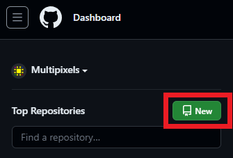
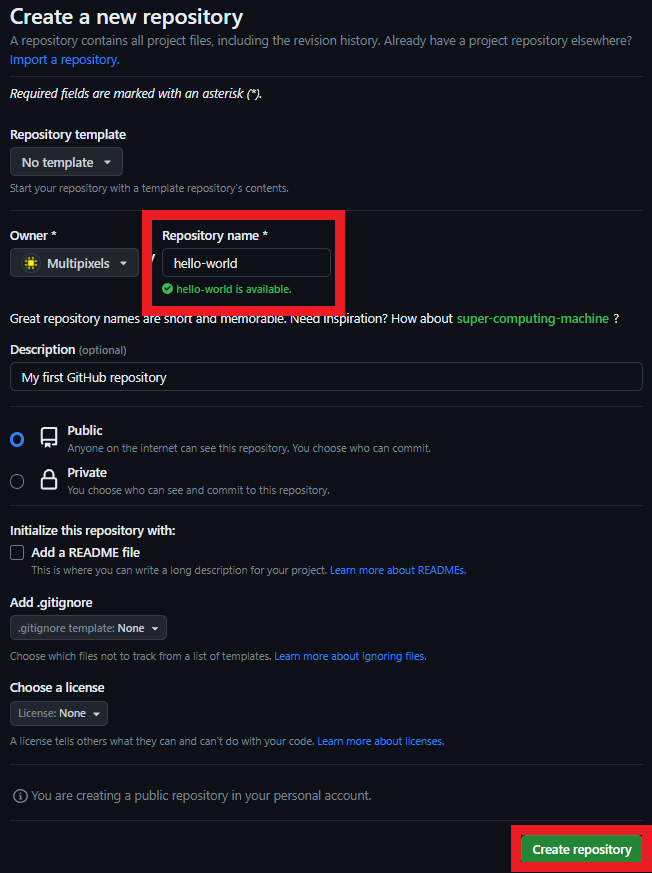
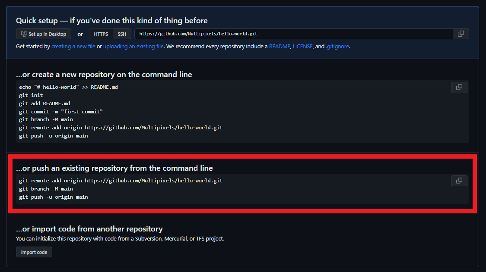
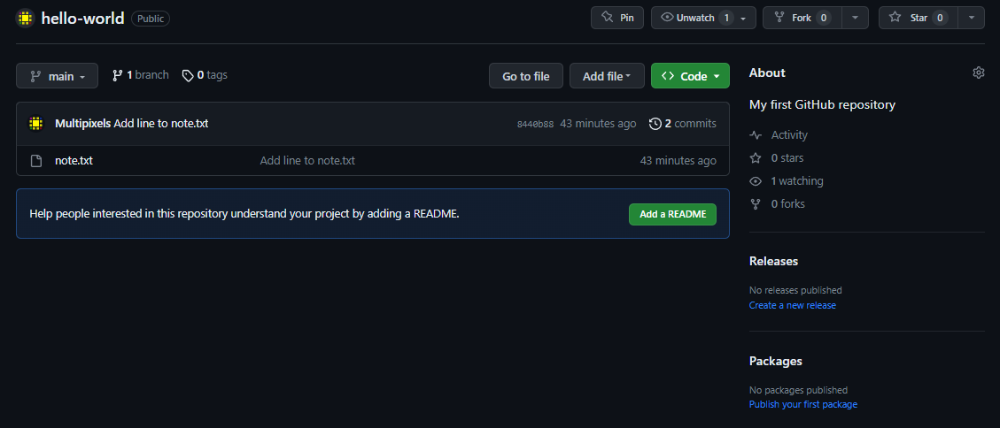

{: .no_toc}  
# Lesson 2 - Connecting Git to GitHub

While you can just use Git locally, connecting your repository to GitHub will allow you to work on multiple machines and share your project with others.

<details markdown="block">
  <summary>
    Table of Contents
  </summary>
  {: .text-delta }
- TOC
{:toc}
</details>

## Lesson Objectives
- Link your Git repository to GitHub
- "Push" and "Pull" commits between your local repository and remote repository

<!-- ## Lesson Video
The following video demonstrates each of the steps outlined below in text.

<iframe height="416" width="100%" allowfullscreen frameborder=0 src="https://echo360.ca/media/a65689c0-c35c-4f33-9c12-f0ac97883f54/public?autoplay=false&automute=false"></iframe>
[View original here.](https://echo360.ca/media/a65689c0-c35c-4f33-9c12-f0ac97883f54/public?autoplay=false&automute=false) -->

## Creating a Repository on GitHub

We need to create a blank repository in GitHub to connect our local Git repository to GitHub.

- If you haven't already, open up [GitHub](https://github.com) and log in.
- From the [GitHub main page](https://github.com), click on the `New` button at the top left of the page.



- Provide a name for your repository.
  - There are some characters that are not allowed in your repository name, such as spaces and certain symbols.
- Optionally, you can also include a small description about your new repository.
- Do **not** select any settings from the "Initialize this repository with" section. We want to initialize our repository using our local Git repository.
- Click on the green `Create repository` button when you're finished.



## Pushing our Existing Repository

- After creating the repository, you should now see some instructions to create a new repository or push an existing repository.
- Copy the commands outlined under **...or push an existing repository from the command line** one at a time into your Git terminal.



```bash
git remote add origin https://github.com/username/hello-world.git
```

{: .note }
Copy the URL from your own GitHub repository. Make sure to use your own username where it says `username`.

```bash
git branch -M main
```
- This line renames our default branch to "main", in the case that it was still "master".

```bash
git push -u origin main
```

- Finally, this line pushes our local repository to GitHub.

Once that is set up, you can refresh your GitHub page and you should see your "note.txt" there.



## Pushing and Pulling Commits

The repository on your computer is known as your local repository, whereas the repository on GitHub is known as the remote repository. Changes made in your local repository won't immediately show up in your remote repository, and vice-versa. 

In order for the repositories to sync with each other, you have to **push** or **pull** commits.

Push
: Changes from your local repository will be pushed up to your remote repository.

Pull
: Changes from your remote repository will be pulled down to your local repository.

### Pushing to GitHub

Let's make some changes to our `note.txt`. Add a line, remove a line, whatever you'd like.

Create a commit with `git commit`. 

If you'll take a look at the remote repository on GitHub, you'll notice that `note.txt` has not changed since your commit locally. That's because we have not yet pushed our changes.

To push our changes, we use the `git push` command.

```bash
git push
```

Now, the changes made to `note.txt` will appear in GitHub.

### Pulling to your Local Repository

While we've only been making changes to our repository locally, we can also make changes on the GitHub web interface as well.

- Go back to your GitHub web interface and select the `note.txt` file.
- Click on the pencil icon at the top right, and edit the file.
- Commit your changes.

Of course, if we look at our `git log`, we'll see that our newest commit has not shown up yet. That's because we need to pull the changes down using the `git pull` command.

```bash
git pull
```

Now you should see all your commits in `git log`.

{: .note }
It's recommended to always pull before making any commits and changes. This reduces the chance of any nasty merge conflicts, which we won't cover in this module.

## Key Points / Summary

- We can connect our local repository to GitHub
- We have to pull and push to let the repositories communicate with each other 
